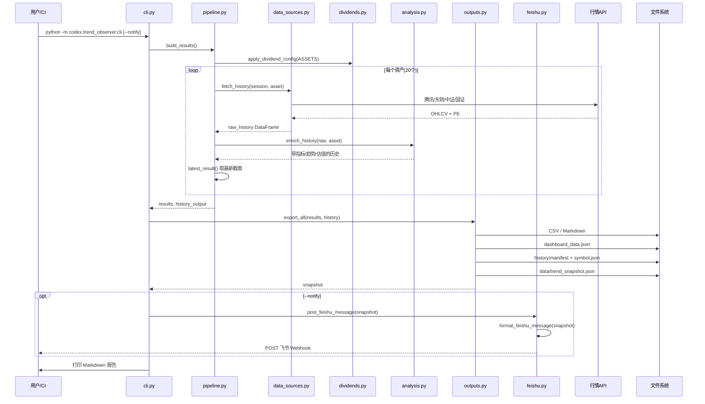
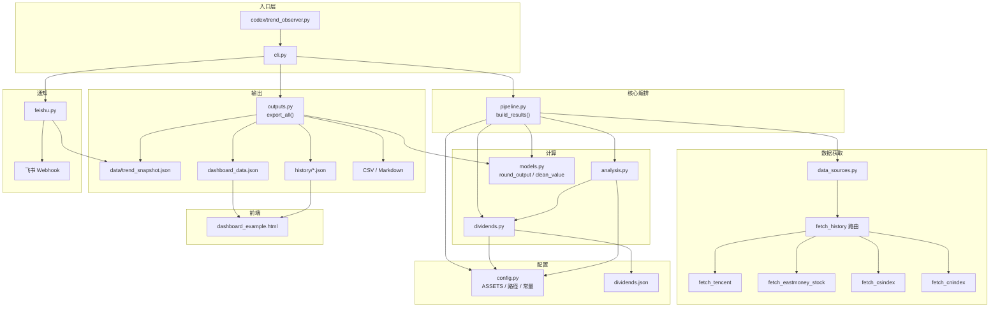

# 趋势观察台架构

本文档描述当前仓库的目录结构、执行流程与模块调用关系（模块化重构后版本）。

## 当前目录树

```
quantification/
├── .github/
│   └── workflows/
│       └── daily_trend_observer.yml     # 每日 CI：生成 + 飞书 + 提交 + Pages
├── .gitignore
├── README.md                            # 运行说明
├── ARCHITECTURE.md                      # 本文档
├── tests/
│   ├── test_analysis.py                 # 趋势/估值计算测试
│   ├── test_feishu.py                   # 飞书消息格式测试
│   └── test_outputs.py                  # 快照/导出测试
└── codex/
    ├── trend_observer.py                # 兼容旧入口（22 行，转发到 cli）
    ├── requirements.txt
    ├── dividends.json                   # 股票分红手工配置
    ├── dashboard_example.html           # 看板（单文件 HTML/CSS/JS，~1338 行）
    ├── dashboard_data.json              # 看板截面数据（CI 提交，本地 gitignore）
    ├── data/
    │   └── trend_snapshot.json          # 统一快照（CI 提交）
    ├── history/                         # 按 symbol 拆分的历史序列（CI 提交）
    │   ├── manifest.json
    │   └── {symbol}.json × 20
    ├── trend_observer/                  # 核心业务包
    │   ├── __init__.py
    │   ├── cli.py                       # 命令行入口
    │   ├── config.py                    # 路径、常量、ASSETS、REPORT_COLUMNS
    │   ├── data_sources.py              # 行情抓取 + 数据源路由
    │   ├── dividends.py                 # 分红配置 + 股息率
    │   ├── analysis.py                  # 指标、趋势、估值、信号
    │   ├── pipeline.py                  # 单次抓取与分析编排
    │   ├── models.py                    # 序列化/舍入工具
    │   ├── outputs.py                   # 快照、看板、历史、报告导出
    │   └── feishu.py                    # 飞书消息 + Webhook
    └── site/                            # CI 临时生成，不在 git（gitignore）
        ├── index.html
        ├── dashboard_data.json
        └── history/
```

**本地生成、gitignore 的产物**（CI 以 artifact 保留，不提交 git）：

- `codex/trend_observer_report.csv` / `.md`
- `codex/trend_history.csv` / `.json`

---

## 执行流程

### 本地 / CI 主流程



**入口命令：**

```bash
# 推荐
python -m codex.trend_observer.cli
python -m codex.trend_observer.cli --notify

# 兼容旧入口
python codex/trend_observer.py
python codex/trend_observer.py --notify
```

### GitHub Actions 流程

`.github/workflows/daily_trend_observer.yml` 在 cron `07:10 CST`（UTC `23:10`）或手动触发时：

1. `pip install -r codex/requirements.txt`
2. `python -m codex.trend_observer.cli --notify`
3. `git add -f codex/data/trend_snapshot.json codex/dashboard_data.json codex/history` → commit → push
4. 上传 artifact（报告 + 快照 + history，保留 30 天）
5. 组装 `codex/site/`（复制 `dashboard_example.html` → `index.html` + JSON + history）
6. `deploy-pages` 发布 GitHub Pages

### 看板消费流程

`codex/dashboard_example.html` 在浏览器中：

1. 密码门禁（sessionStorage）
2. `loadLatestData()` fetch `./dashboard_data.json`（截面）
3. fetch `./history/manifest.json` → 并行加载各 `./history/{symbol}.json`（图表用）
4. fallback：`./trend_history.json`（Pages 站点**未复制**此文件，仅本地有效）
5. 渲染 KPI / 优先关注 / 表格 / 详情 Modal / SVG 图表

> 看板目前仍读 `dashboard_data.json`，**不直接读** `trend_snapshot.json`；飞书则从 snapshot 派生，保证与 snapshot 同源。

---

## 模块调用关系



---

## 各模块职责

| 模块 | 职责 | 主要被谁调用 |
|------|------|-------------|
| `config.py` | 20 个资产清单、输出路径、阈值常量 | 全局 |
| `data_sources.py` | HTTP 抓取；股票优先东财再腾讯 | `pipeline.py` |
| `dividends.py` | 读 `dividends.json`，算股息率 | `pipeline.py`、`analysis.py` |
| `analysis.py` | MA/斜率/收益率/PE 百分位/短中长期趋势/估值/信号 | `pipeline.py` |
| `pipeline.py` | 单次 pass：抓取 → enrich → 最新截面 | `cli.py` |
| `models.py` | 数值舍入、JSON 序列化 | `pipeline.py`、`outputs.py` |
| `outputs.py` | 统一快照 + 派生看板/历史/报告 | `cli.py` |
| `feishu.py` | 从 snapshot 格式化并发送 | `cli.py`（`--notify`） |
| `cli.py` | 串联 pipeline → export → 可选飞书 | 入口 |
| `dashboard_example.html` | 静态看板 UI + 图表 | 浏览器 / Pages |

### 文件职责详述

- **`codex/trend_observer.py`**：兼容旧命令的入口，转发到模块化 CLI。
- **`codex/trend_observer/cli.py`**：命令行入口，串联完整流程和飞书发送。
- **`codex/trend_observer/config.py`**：路径、常量、资产清单和报告字段。
- **`codex/trend_observer/data_sources.py`**：行情数据获取和数据源路由（腾讯、东方财富、中证、国证）。
- **`codex/trend_observer/dividends.py`**：股票上一年每股分红配置和股息率计算。
- **`codex/trend_observer/analysis.py`**：指标、趋势、估值和信号计算。
- **`codex/trend_observer/pipeline.py`**：一次性抓取与分析，避免看板或飞书重复抓取。
- **`codex/trend_observer/models.py`**：序列化与舍入工具，供输出层和测试复用。
- **`codex/trend_observer/outputs.py`**：统一 JSON、看板 JSON、历史 JSON、报告导出。
- **`codex/trend_observer/feishu.py`**：飞书消息模板和 webhook 发送。

---

## 数据流

1. `data_sources.py` 从中证、国证、腾讯、东方财富抓取日线行情。
2. `analysis.py` 计算收益率、均线、斜率、短中长期趋势、综合状态、PE 百分位和估值状态。
3. `pipeline.py` 对资产清单执行一次完整抓取和计算，产出最新截面与历史序列。
4. `outputs.py` 导出统一快照 `codex/data/trend_snapshot.json`，并派生：
   - `codex/dashboard_data.json`
   - `codex/history/manifest.json`
   - `codex/history/{symbol}.json`
   - CSV 和 Markdown 报告
5. `feishu.py` 从统一快照生成飞书消息并发送。
6. `dashboard_example.html` 读取 `dashboard_data.json` 和 `history/` 展示看板。

---

## 关键设计

### 相对重构前的变化

1. **单次抓取**：`pipeline.build_results()` 只跑一遍，飞书不再独立重算，而是从 `trend_snapshot.json` 读。
2. **统一快照**：`outputs.export_snapshot()` 写入 `codex/data/trend_snapshot.json`，含 `schema_version`、`assets`、`history_manifest`。
3. **包化入口**：正式入口为 `python -m codex.trend_observer.cli`；`codex/trend_observer.py` 仅为兼容 wrapper。
4. **测试**：`tests/` 覆盖 analysis、feishu、outputs 三块。

### 仍存在的跨层耦合

- **看板仍是单文件**：`dashboard_example.html` 内嵌 CSS/JS/图表，估值阈值（`valuationStatusFromPercent`）与 Python `valuation_status()` 仍各自维护。
- **看板 vs 飞书数据源路径不同**：看板读 `dashboard_data.json`，飞书读 snapshot；内容同源（同一次 `export_all`），但文件分离。
- **CI 站点未部署 snapshot**：Pages 只复制 `dashboard_data.json` + `history/`，不复制 `trend_snapshot.json`。

---

## 外部依赖

| 数据源 | API | 用途 |
|--------|-----|------|
| 腾讯 | `web.ifzq.gtimg.cn` | 指数/股票 K 线（前复权） |
| 东方财富 | `push2his.eastmoney.com` | 股票 K 线（优先） |
| 中证指数 | `csindex.com.cn` | 指数 K 线 + PE |
| 国证指数 | `hq.cnindex.com.cn` | 国证现金流指数 |

飞书通知依赖环境变量 `FEISHU_WEBHOOK_URL`（必填）和 `FEISHU_SECRET`（可选签名）。
